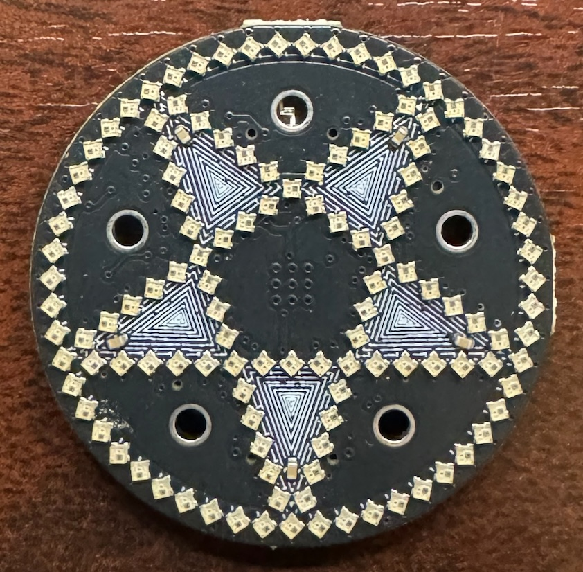
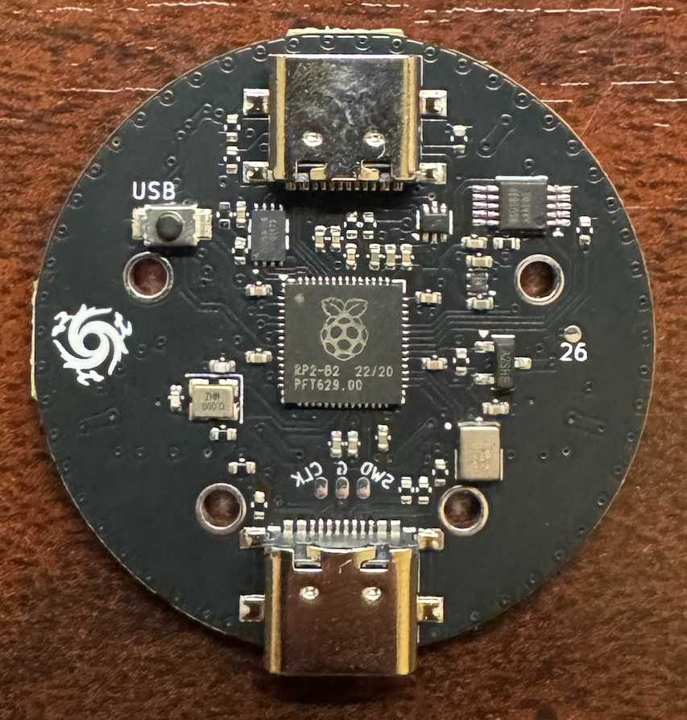

# motionhexa

PCB designs and code for a Five-pointed star circumscribed within a circle of 55 pixels, for a total of 5³=125 pixels.

## Controls

The Five through-hole circles on the penta are touch-reactive and used to set the pattern.

## Hardware

* RP2040 dual-core ARM processor
* T3902 microphone
* WS2812B-1010 pixels

# Project layout

* board/ contains the KiCad pcb project
* src/ all project-specific source
* lib/ a skeleton copy of [kissfft], and submodule dependency *dustlib*

The project is built using [PlatformIO] in Visual Studio Code.

## Building

Build the v2 environment in the [PlatformIO] project, which corresponds to the MakerFaire2025 hardware.

### Libraries & Dependencies
PlatformIO should fetch the apprpriate version of each dependency on first build.

* [FastLED] - A library for fast 8-bit math and rendering colors onto pixels
* [kissfft] - A simple library used to compute an fft on audio samples
* [dustlib] - My work-in-progress pixel library

[FastLED]: https://github.com/FastLED/FastLED
[PlatformIO]: <https://platformio.org>
[kissfft]: <https://github.com/mborgerding/kissfft>
[dustlib]: <https://github.com/starduststorm/dustlib>
